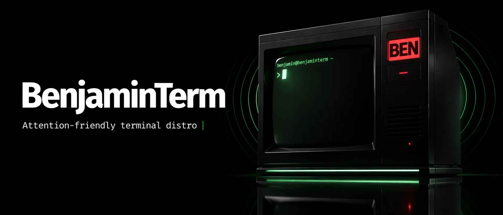
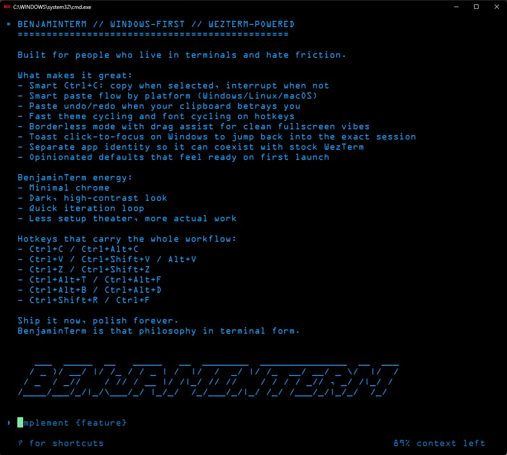

<p align="center">
  
</p>

# BenjaminTerm - AI Coding Terminal for Windows

[](https://github.com/avalonreset/BenjaminTerm/releases/latest)
[](https://github.com/avalonreset/BenjaminTerm/actions/workflows/benjaminterm-release.yml)
[](LICENSE.md)
[](https://github.com/avalonreset/BenjaminTerm/releases/latest)
[](https://github.com/0xType/0xProto)
[](https://wezterm.org/)

BenjaminTerm is a Windows-first terminal for AI coding sessions, rebuilt from a fresh WezTerm baseline and tuned for Codex, Claude, HyperYap, and multi-window agent work. It keeps the power of WezTerm, then adds a sharper product layer: bundled 0xProto, theme shuffle-bag, per-pane sound identity, visual completion pulse, and Windows toast click-to-focus.

```text
   ___  _____  __   _____   __  ________  _______________  __  ___
  / _ )/ __/ |/ /_ / / _ | /  |/  /  _/ |/ /_  __/ __/ _ \/  |/  /
 / _  / _//    / // / __ |/ /|_/ // //    / / / / _// , _/ /|_/ /
/____/___/_/|_/\___/_/ |_/_/  /_/___/_/|_/ /_/ /___/_/|_/_/  /_/
```

## Table of Contents

- [Screenshot](#screenshot)
- [Why BenjaminTerm](#why-benjaminterm)
- [Features](#features)
- [Attention System](#attention-system)
- [0xProto Philosophy](#0xproto-philosophy)
- [HyperYap Sister Project](#hyperyap-sister-project)
- [Hotkeys](#hotkeys)
- [Install](#install)
- [Platform Status](#platform-status)
- [Release Infrastructure](#release-infrastructure)
- [Upstream Credit](#upstream-credit)
- [License](#license)

## Screenshot



## Why BenjaminTerm

Vanilla WezTerm is excellent, but it expects you to assemble your own workflow. BenjaminTerm is the opinionated build: the terminal is already styled, already branded, already tuned for AI coding, and already packaged so a fresh machine does not nag you for fonts.

HyperYap owns the speech-to-text, smart paste, image paste, and clipboard intelligence layer. BenjaminTerm does not duplicate that. The terminal focuses on the part HyperYap cannot own: attention, readability, sound cues, terminal identity, and a calmer default environment for agent-heavy work.

The two projects are meant to be used together. HyperYap is the complete AI workstation layer. BenjaminTerm is the focused terminal inside that workstation. HyperYap includes BenjaminTerm by default because the best speech and clipboard system still needs a terminal that knows how to route attention when agents finish their work.

| Feature | Windows Terminal | WezTerm (vanilla) | BenjaminTerm |
|---------|------------------|-------------------|--------------|
| AI session completion pulse | No | No | Built-in |
| Per-pane sound identity | No | No | Built-in |
| Windows toast click-to-focus | Basic app focus | No | Exact ready session workflow |
| Theme shuffle-bag | No | Manual Lua config | Built-in |
| Bundled coding font | Limited | User supplied | 0xProto bundled |
| Single-line tab behavior | Basic | Config required | Fancy tabs, hidden for one tab |
| Side-by-side install with WezTerm | N/A | N/A | Yes |
| HyperYap companion workflow | No | Manual | Designed for it |

## Features

### Agent Attention

- Plays a subtle sound when Codex, Claude, or another terminal agent is ready for the next prompt.
- Assigns sounds per pane from a shuffled grab bag, so separate windows and tabs can develop their own identity.
- Pulses the active terminal visually when attention is needed.
- Marks background tabs when the ready pane is not visible.
- Shows Windows reminder toasts when the ready pane is not focused.
- Clicking a toast focuses the matching terminal and triggers another visual cue.
- Typing into the pane clears the pending reminder.

### Theme Shuffle-Bag

- BenjaminTerm picks from curated black-background themes on launch.
- Rotation uses a shuffle-bag so new windows cycle through the pool instead of repeating the same theme over and over.
- `Ctrl+Alt+T` cycles to another theme on demand.
- Theme state is stored in the BenjaminTerm state file.

### 0xProto Built In

- Bundles only 0xProto: regular, bold, and italic.
- No JetBrains Mono bundle, no Roboto bundle, no Noto bundle, no OCR A dependency.
- Fresh installs work without sending users on a font hunt.
- The 0xProto license is included with the font files.

### Windows-First Branding

- Custom BenjaminTerm app identity.
- BEN visual assets restored in the repo and README.
- Windows installer and portable zip are published from GitHub Actions.
- Vanilla WezTerm can still live beside BenjaminTerm.

## Attention System

BenjaminTerm treats agent completion as an attention routing problem.

The old terminal model assumes you are staring at one shell. AI coding does not work that way. A real workflow often has multiple windows, multiple tabs, and multiple agents moving at different speeds. When one finishes, the terminal should not merely shade the taskbar and hope you notice. It should route your attention cleanly.

BenjaminTerm uses a layered strategy:

- Sound first: each pane gets a sound from the bundled soft CC0 cue set.
- Color second: the ready terminal gets a theme-aware visual pulse.
- Tabs third: if the ready pane is hidden, the tab receives an attention marker.
- Toasts when useful: Windows reminder toasts appear when the pane is not focused.
- Click-to-focus as confirmation: clicking a toast brings the matching window forward and pulses it again.
- Input clears intent: when you start typing into the pane, the pending reminder is cleared.

The goal is not noise. The goal is a faster loop. You hear that something finished, see where it finished, click directly into it if needed, and keep moving.

## 0xProto Philosophy

The font is not decoration. In a terminal, the font is part of the productivity system.

AI coding creates walls of text: patches, test logs, prompts, shell output, stack traces, and generated code. Every ambiguous character makes the loop slower. Every cramped glyph makes scanning harder. Every ugly fallback on a new machine breaks the product feeling.

BenjaminTerm chooses [0xProto](https://github.com/0xType/0xProto) because it is hackerish without being sloppy, readable without being sterile, and legally bundleable with the project. It is designed for source code clarity, including strong differentiation between similar characters and a balanced monospace rhythm.

Our thesis:

- Readability is speed.
- Ambiguous characters are friction.
- A terminal font should make dense output feel less chaotic.
- A default font should be good enough that users do not need to think about it.
- Packaging the right font is a product decision, not a cosmetic afterthought.

BenjaminTerm does not ask users to install the font separately. It ships with the selected font because the selected font is part of the experience.

## HyperYap Sister Project

[HyperYap](https://github.com/avalonreset/hyperyap) and BenjaminTerm are sister projects.

HyperYap is the larger operating layer for AI work on Windows: voice-to-text, hotkey remapping, clipboard intelligence, image handling, and the kind of input workflow that should work across every app. BenjaminTerm is the terminal built to live inside that system.

That separation is intentional:

- HyperYap handles what you say, paste, capture, and route into the computer.
- BenjaminTerm handles where the AI work runs, how it looks, how it sounds, and how it asks for your attention.
- HyperYap can bundle BenjaminTerm as the default terminal experience.
- BenjaminTerm remains available as a standalone release for users who want the terminal by itself.

The standalone release exists because the terminal is useful on its own. The full vision is the pair: HyperYap as the workstation, BenjaminTerm as the terminal that feels native to that workstation.

## Hotkeys

| Action | Hotkey |
|--------|--------|
| Cycle theme | `Ctrl+Alt+T` |
| Cycle theme alternate | `Ctrl+Alt+Shift+T` |
| Font size down | `Ctrl+-` |
| Font size up | `Ctrl+=` |
| Reset font size | `Ctrl+0` |
| New tab | WezTerm default, usually `Ctrl+Shift+T` |
| Close tab | WezTerm default, usually `Ctrl+Shift+W` |

Clipboard, speech-to-text, smart paste, image paste, and vibe-coding hotkeys belong to [HyperYap](https://github.com/avalonreset/hyperyap). BenjaminTerm is designed to work beside it.

## Install

### Windows

Download the latest release:

https://github.com/avalonreset/BenjaminTerm/releases/latest

Recommended installer:

`BenjaminTerm-v1.4.1-setup.exe`

Portable zip:

`BenjaminTerm-windows-v1.4.1.zip`

### macOS and Linux

Best-effort builds are published with each release:

- macOS: `BenjaminTerm-macos-v1.4.1.zip`
- Linux: `BenjaminTerm-linux-v1.4.1.tar.gz`

Windows is the primary supported platform. macOS and Linux builds are produced by CI, but they have not been manually tested yet.

## Platform Status

| Platform | Status | Notes |
|----------|--------|-------|
| Windows | Supported | Installer, portable zip, toast click-to-focus, sound cues, visual pulse |
| macOS | Best effort | Portable artifact builds in CI |
| Linux | Best effort | Portable artifact builds in CI |

## Release Infrastructure

BenjaminTerm release infrastructure is pinned to Node.js `25.9.0`.

The release workflow installs and verifies Node.js `25.9.0` on every release path:

- Windows build job
- macOS build job
- Linux build job
- GitHub release publisher job

The repository includes `.node-version` so local development shells using `fnm` also resolve to Node.js `25.9.0`.

## Build From Source

Required release tooling:

```powershell
node --version
# v25.9.0
```

Windows release build:

```powershell
cargo build -p wezterm -p wezterm-gui -p wezterm-mux-server -p strip-ansi-escapes --release
```

Create a local Windows portable zip:

```powershell
powershell -NoProfile -ExecutionPolicy Bypass -File .\ci\package-benjaminterm-windows.ps1 -TagName local
```

The tag-driven release workflow lives at:

`.github/workflows/benjaminterm-release.yml`

Tags matching `v[0-9]*` build Windows, macOS, and Linux artifacts.

## Other Projects

**[HyperYap](https://github.com/avalonreset/hyperyap)** - Local voice-to-text for Windows with hotkey remapping and smart clipboard image handling. The recommended companion for BenjaminTerm.

**[gemini-seo](https://github.com/avalonreset/gemini-seo)** - Professional SEO workflows for Gemini CLI.

**[codex-seo](https://github.com/avalonreset/codex-seo)** - SEO workflows built for Codex CLI with parallel agents and client-ready reports.

## Upstream Credit

BenjaminTerm is a custom distribution built on [WezTerm](https://github.com/wezterm/wezterm) by Wez Furlong.

- Upstream project: [wezterm/wezterm](https://github.com/wezterm/wezterm)
- Upstream docs: [wezterm.org](https://wezterm.org/)

BenjaminTerm changes are intentionally scoped. The goal is to add a productive AI coding layer without rewriting the terminal engine.

## License

BenjaminTerm keeps WezTerm's MIT license. The bundled 0xProto font and bundled soft CC0 sounds retain their own licenses. See [LICENSE.md](LICENSE.md), `assets/fonts`, and `assets/sounds/benjaminterm-soft-cues`.
